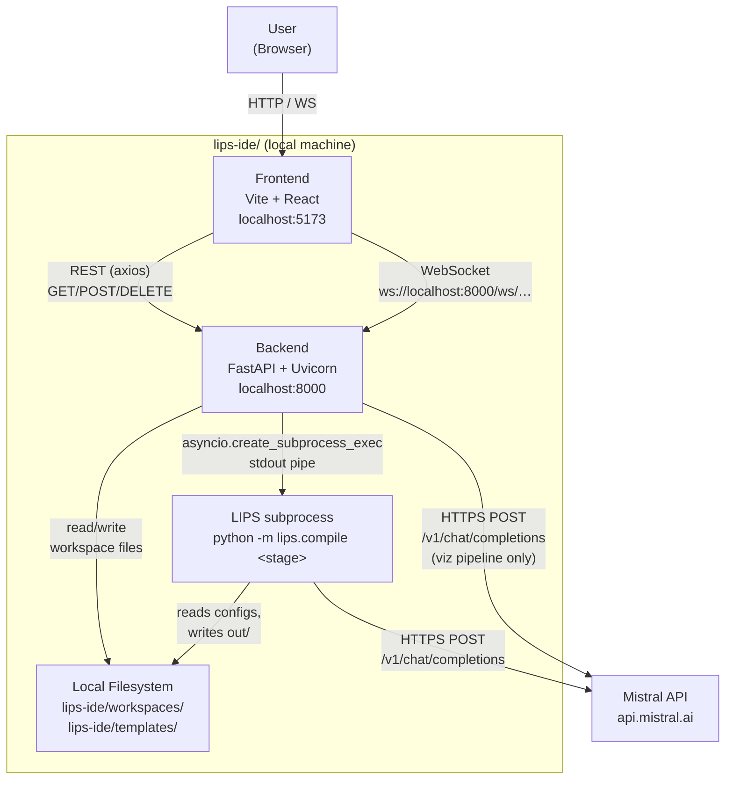
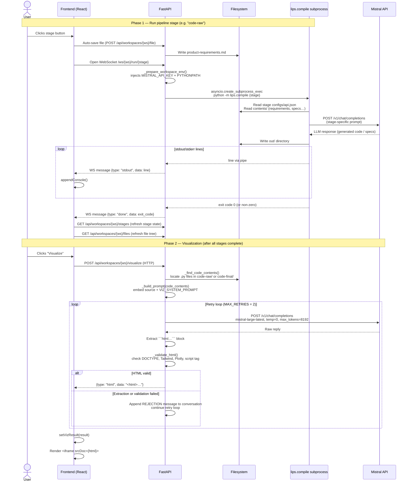
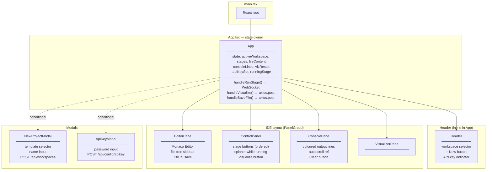

# LIPS IDE — Architecture

LIPS IDE is a local, full-stack web application. A Vite/React frontend talks to a FastAPI backend over HTTP and WebSockets. The backend orchestrates two distinct AI-powered pipelines: a **LIPS compile pipeline** (runs a Python subprocess that calls Mistral to transform natural-language requirements into simulation code) and a **visualization pipeline** (calls Mistral directly to turn that code into an interactive HTML page rendered in an iframe).

The visualization pipeline was designed following the reliability principles from the Google Research paper *"Generative UI: LLMs are Effective UI Generators"* (Leviathan et al.). See [generative-ui-guardrails.md](generative-ui-guardrails.md) for a full mapping of every paper principle to its implementation.

---

## 1. System Context



**Key boundaries:**

- The frontend never talks to Mistral directly. All AI calls route through the backend.
- The LIPS compile stages each run as an isolated subprocess (`python -m lips.compile <stage>`). The backend streams their stdout/stderr in real time over the WebSocket.
- The visualization pipeline skips the subprocess entirely — the backend calls Mistral directly and returns the generated HTML.
- All workspace data lives on disk under `lips-ide/workspaces/`. Nothing is stored in memory across requests.

---

## 2. Sequence Diagram: The Iterative Pipeline

This covers both a **pipeline stage run** (WebSocket / subprocess) and a **visualization run** (HTTP / direct LLM call).



**Notable implementation details in this flow:**

- `_prepare_workspace_env()` writes `MISTRAL_API_KEY` directly into the subprocess environment dict — it never relies solely on the `.env` file being loaded inside the child process.
- stdout and stderr are merged (`stderr=STDOUT`) so a single `readline()` loop handles both streams.
- The visualization retry loop is conversational: on each bad response the rejection message is appended as a user turn and the full message history is re-sent to the LLM, giving it the context to self-correct.
- The iframe uses `sandbox="allow-scripts allow-same-origin"` — Plotly 3D mouse drag works because `allow-same-origin` is included, while `window.parent` / `window.top` access is blocked by the viz pipeline prompt rules.

---

## 3. Component Diagram

### 3a. Frontend — React component tree



All API calls are made from `App.tsx`. Child components receive data and callbacks as props — they do not call the backend directly.

### 3b. Backend — FastAPI routers and service layer

```mermaid
graph TD
    subgraph "main.py — FastAPI app"
        direction TB

        subgraph "Config endpoints"
            C1["GET /api/config/apikey\n→ masked key status"]
            C2["POST /api/config/apikey\n→ _write_key_everywhere()"]
        end

        subgraph "Template endpoints"
            T1["GET /api/templates\n→ list TEMPLATES_DIR"]
        end

        subgraph "Workspace endpoints"
            W1["GET /api/workspaces\n→ _discover_stages()"]
            W2["POST /api/workspaces\n→ shutil.copytree + seed .env\n+ write SAMPLE_REQUIREMENTS"]
            W3["DELETE /api/workspaces/{id}\n→ shutil.rmtree"]
        end

        subgraph "Stage & file endpoints"
            S1["GET /api/workspaces/{id}/stages\n→ _discover_stages()"]
            S2["GET /api/workspaces/{id}/files\n→ rglob contents/"]
            S3["GET /api/workspaces/{id}/file\n→ _safe_path() + read"]
            S4["POST /api/workspaces/{id}/file\n→ _safe_path() + write"]
        end

        subgraph "WebSocket endpoint"
            WS["WS /ws/{id}/run/{stage}\n→ run_lips_stage()"]
        end

        subgraph "Visualization endpoint"
            V1["POST /api/workspaces/{id}/visualize\n→ run_visualization()"]
        end
    end

    subgraph "lips_runner.py"
        LR["run_lips_stage(websocket, workspace, stage)\n──────────────────────────────────────────\n_prepare_workspace_env()\n  write key to workspace .env\n  build PYTHONPATH with lips-ide/ root\nasyncio.create_subprocess_exec\n  python -m lips.compile {stage}\nstream stdout lines → websocket.send_json\nwait() → send done event"]
    end

    subgraph "viz_pipeline.py"
        VP["run_visualization(workspace_path)\n──────────────────────────────────────────\nload_dotenv + check MISTRAL_API_KEY\n_find_code_contents()\n_build_prompt(code)\nretry loop (MAX_RETRIES=2):\n  _call_mistral(api_key, messages)\n    POST mistral-large-latest\n    extract ```html``` block\n  _validate_html(html)\n    DOCTYPE / Tailwind / Plotly / script\n  on fail: append REJECTION msg + retry\nreturn {type:'html', data:html}"]
    end

    subgraph "Filesystem helpers (main.py)"
        H1["_is_lips_stage(path)\n→ checks configs/api.json"]
        H2["_discover_stages(ws)\n→ sorted stage list + has_output flag"]
        H3["_safe_path(ws, rel)\n→ path traversal guard (403)"]
        H4["_resolve_workspace(id)\n→ 404 if not found"]
    end

    WS --> LR
    V1 --> VP
    W1 --> H2
    S1 --> H2
    S3 --> H3
    S4 --> H3
    S3 --> H4
    S4 --> H4
    W3 --> H4
```



**Filesystem layout** that the backend reads and writes:

```
lips-ide/
├── workspaces/
│   └── {workspace-name}/
│       ├── .env                        ← MISTRAL_API_KEY per workspace
│       ├── requirements/
│       │   ├── configs/api.json        ← LIPS stage config (marks as stage)
│       │   ├── contents/
│       │   │   └── product-requirements.md  ← user writes here
│       │   └── out/                    ← written by lips.compile
│       ├── specifications/
│       │   ├── configs/api.json
│       │   ├── contents/
│       │   └── out/
│       └── code-raw/
│           ├── configs/api.json
│           ├── contents/
│           └── out/
└── templates/
    └── physical-simulations/
        └── {template-name}/            ← same structure as workspaces
```
